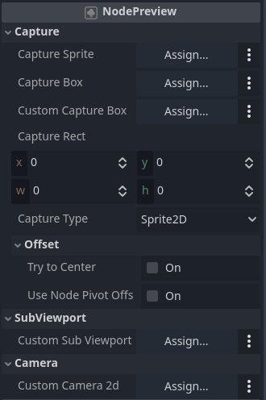

# NodePreview
 A plugin for Godot 4.2+ to help you make "screenshots" or "image" of any sprite in 2D world
(Probably also in 3D in the future)

## Docs
- Settings
    - [Capture section](#Capture)
    

## Capture
