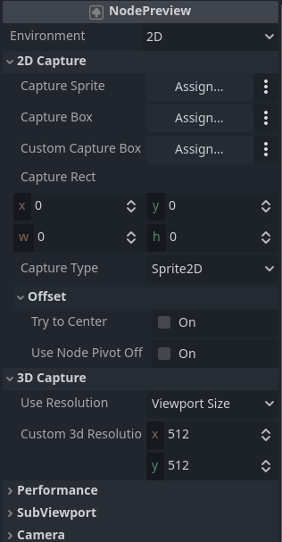
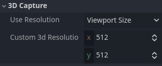
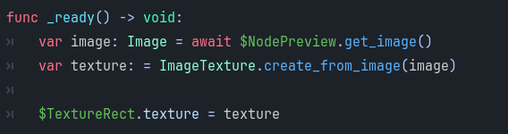
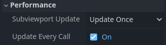
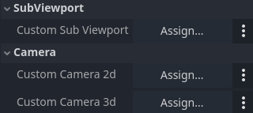
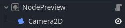
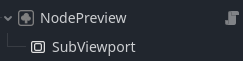
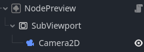

# NodePreview
A plugin for Godot 4.2+ to help you make "screenshots" or "image" of any sprite in 2D world
(Probably also in 3D in the future)

## Docs
- Settings
	- [Capture section](#Capture)
		- [Capture types](#Capture-types)
			- Capture Sprite
			- Capture Box
			- Custom Capture Box
			- Capture Rect
		- [Offset settings](#offset-settings)
			- Try to center
			- Use node pivot offset
		- [How to get image](#how-to-get-an-image)
	- [Performance](#performance)
	- [SubViewport](#custom-camera-and-subviewport)
	- [Camera](#custom-camera-and-subviewport)

	- [Contact and collaboration](#contact-and-collaboration)
	- [Future update](#future-updates)


# Node


# Capture 2D
## Capture types
- Capture Sprite
	- It takes an image perferctly aligned to the sprite texture (rect)
- Capture Box
	- [**Check this!**](#try-to-center-important) If you are using TextureRect
	- It uses TextureRect
	- It uses the rect of the box to take an image
- Custom Capture Box
	- Basically the same as **Capture Box** but you can enter your custom node with rect
- Capture Rect
	- If you don't want to use node, to select an area. You can do it from the code

### Capture Type
- Select what type do you want to use. **Remember** to set the specific capture type, so it won't result in an error

## Offset
- You can offset the camera, so the texture will be offset

### Offset settings

#### Try to center ***(Important!)***
- If you are using anything different than sprite2D, you would probably need to turn this on.

#### Use node pivot offset
- If your node has some sort of offset (Pivot offset or offset), you can apply it.

# Capture 3D




## Use resolution

- Viewport Size
	- It uses the root viewport
- Closest Viewport Size 
	- it uses the closest Viewport
- Custom
	- You can set up your custom Viewport below


# How to get an image
- You can reference NodePreview and then call ```.get_image()``` from it
	- It will return **Image** not **ImageTexture** used for sprites2D, TextureRect etc.
	- If you want to convert from **Image** to **ImageTexture** you need to do it like this:
	- ```var texture: = ImageTexture.create_from_image(image)```
- Example:


# Performance

**for move advanced users**
The default settings render only once, so It isn't very performance-costly, only if you will get image every frame you will have a very big FPS drop.



### Subviewport Update 
- It tell when to render. Check in the Godot docs to **Subviewport UPDATE_MODE**

### Update Every Call
- It will reset the subviewport to Update Once, everytime you will call get_image(), so it will update the render image


# Custom Camera and SubViewport 


***For more advanced users***
This plugin uses Camera and SubViewport to take images of your textures ***(You don't need to set them, it sets them automatically)***. If
You need to change some things, you can set custom Camera or custom SubViewport. You **don't**
need to to it manually, the NodePreview, does this itself. But if you need to use custom settings,
your Camera and SubViewport should be in that specific order like this:
1. 
Or
2. 
Or
3. 

# Contact and Collaboration
If you want to help, feel free to clone the project and make some changes.
If you need more help, or maybe you need to contact me, you can contact me here, on the Github, or on Discord.
My name on discord is: .susdog

# Future updates
I'm not abandoning this project yet, it's simple so the updates are also simple to do.
This is the list of things I would like to add:

- [ ] more image manipulation options
	- [ ] Expand Margins
	- [ ] Border Width
